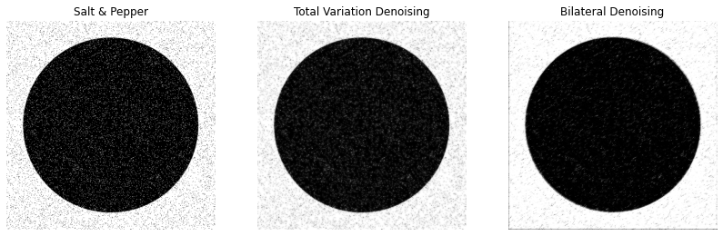
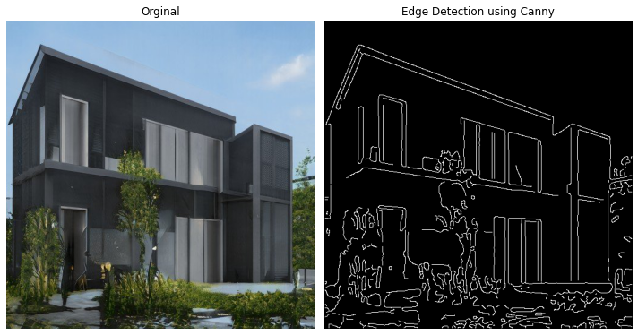
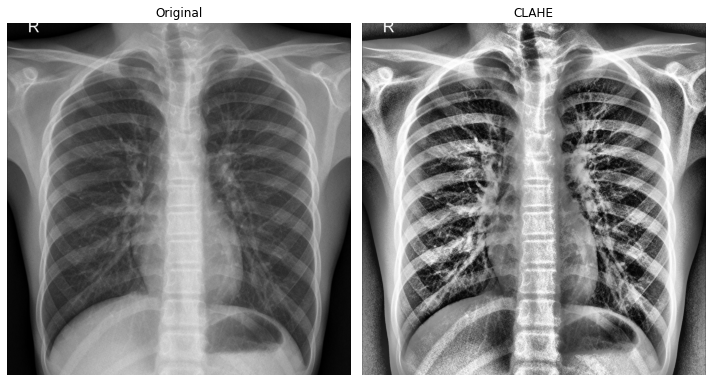

#### Notebook is based upon the two part article found here: [part1](https://towardsdatascience.com/massive-tutorial-on-image-processing-and-preparation-for-deep-learning-in-python-1-e534ee42f122), [part2](https://towardsdatascience.com/massive-tutorial-on-image-processing-and-preparation-for-deep-learning-in-python-2-14816263b4a5)
---

# ImageProcessing
A notebook containing techniques used in image processing such as:

- Channel Splitting
- RGB to Gray Conversion
- Transformations such as flipping, rotation, rescaling & resizing
- Retrieving Histogram
- Filtering
- Masking
- Contrast Enhancement
- Restauration & Enhancement
- Adding & Reducing Noise
- Segmentation
- Contouring
- Edge Detection
- Corner Detection -> (coming soon)
- Scale-invariant feature transform (SIFT) -> (coming soon)

Denoising an image using different techniques.

Applying the Canny algorithm for edge detection.

Amplifying image contrast using contrast limited adaptive histogram equlization (CLAHE)
